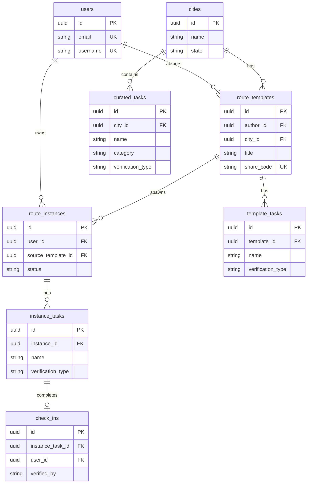
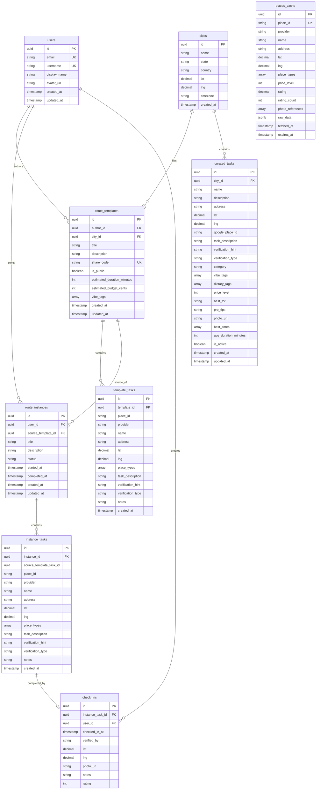

# GoGoCity Database Schema

## A) ERD Overview

### Concise Diagram (for presentations)



### Full Schema Diagram (all fields)



### Text Diagram (fallback)

```
┌─────────────┐
│   users     │
└─────────────┘
       │ 1:N (author)
       ▼
┌─────────────────┐       ┌────────────────┐
│ route_templates │──1:N──│ template_tasks │
└─────────────────┘       └────────────────┘
       │                          │
       │ N:1                      │ snapshot
       ▼                          ▼
┌─────────────┐       ┌───────────────┐
│   cities    │──1:N──│ curated_tasks │
└─────────────┘       └───────────────┘

┌─────────────────┐       ┌────────────────┐       ┌───────────┐
│ route_instances │──1:N──│ instance_tasks │──1:1──│ check_ins │
└─────────────────┘       └────────────────┘       └───────────┘
       │
       │ N:1 (owner)
       ▼
┌─────────────┐
│   users     │
└─────────────┘

┌──────────────┐
│ places_cache │  (standalone cache for Google Places API)
└──────────────┘
```

---

## B) Key Relationships

| Relationship | Type | Description |
|-------------|------|-------------|
| users → route_templates | 1:N | User authors templates |
| users → route_instances | 1:N | User owns instances |
| cities → curated_tasks | 1:N | City contains curated tasks |
| cities → route_templates | 1:N | Templates belong to a city |
| route_templates → template_tasks | 1:N | Template contains tasks |
| route_templates → route_instances | 1:N | Template spawns instances |
| route_instances → instance_tasks | 1:N | Instance contains snapshotted tasks |
| instance_tasks → check_ins | 1:1 | One check-in per task |

---

## C) Task Verification Types

Tasks can have three verification types:

| Type | Has Location | Has Task Action | Verification Method | Example |
|------|-------------|-----------------|---------------------|---------|
| `gps` | ✅ | ❌ | GPS proximity | "Go to Centennial Park" |
| `photo` | ❌ | ✅ | AI photo analysis | "Eat hot chicken" |
| `both` | ✅ | ✅ | GPS + AI photo | "Pet a dog at Centennial Park" |

---

## D) Data Flow

```
1. CURATION (you & Trey)
   └── Add tasks to curated_tasks for each city
       ├── Location-only: "Visit Hattie B's"
       ├── Task-only: "Eat hot chicken" 
       └── Combined: "Order Prince's Hot at Hattie B's"

2. GENERATION (AI)
   └── User submits preferences (vibes, budget, dietary, time)
       └── AI selects matching curated_tasks
           └── Creates route_template with template_tasks

3. IMPORT (user starts route)
   └── User imports template
       └── Creates route_instance with instance_tasks (snapshot)

4. COMPLETION (user plays)
   └── User completes each instance_task
       └── Creates check_in with verified_by (gps/photo/both)
```

---

## E) Tables Summary

| Table | Purpose |
|-------|---------|
| `users` | User identity (email, username, avatar) |
| `cities` | Cities with coordinates and timezone |
| `curated_tasks` | Master list of tasks per city (your curated content) |
| `places_cache` | Cached Google Places API responses |
| `route_templates` | Generated/shared route plans |
| `template_tasks` | Tasks within a template |
| `route_instances` | User's personal copy of a route |
| `instance_tasks` | Snapshotted tasks for the user's instance |
| `check_ins` | Task completion records with verification |
